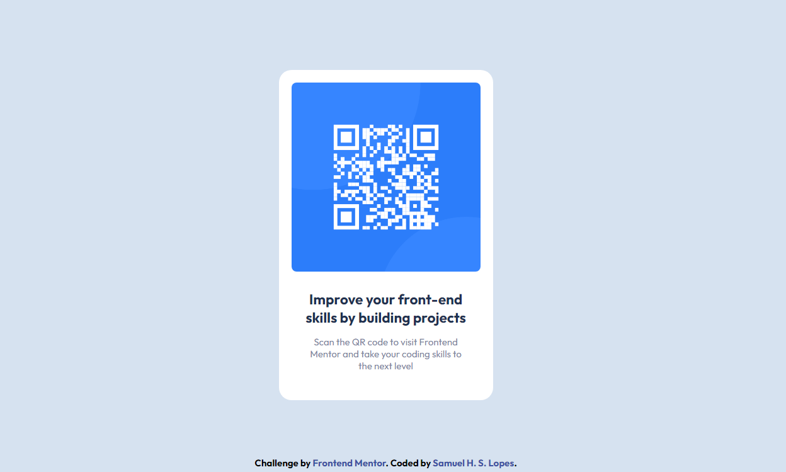

# Frontend Mentor - QR code component solution

This is a solution to the [QR code component challenge on Frontend Mentor](https://www.frontendmentor.io/challenges/qr-code-component-iux_sIO_H). Frontend Mentor challenges help you improve your coding skills by building realistic projects. 

## Table of contents

- [Overview](#overview)
  - [Screenshot](#screenshot)
  - [Links](#links)
- [Built with](#built-with)
- [Author](#author)
- [Acknowledgments](#acknowledgments)

## Overview

### Screenshot

### Links

- Solution URL: [Solution](https://your-solution-url.com)
- Live Site URL: [Demo](https://samuellopes56.github.io/QR-Code-Component/)

## Built with

- HTML5
- CSS3

## Author

- Frontend Mentor - [@SamuelLopes56](https://www.frontendmentor.io/profile/SamuelLopes56)

## Acknowledgments

I want to thank [@MelvinAguilar](https://www.frontendmentor.io/profile/MelvinAguilar) for a comment [directed at another user solution ](https://www.frontendmentor.io/solutions/qr-code-component-8-gPVXPiou)
 about using max-widith and margin instead of &lt;br&gt; to a better control the position of my text elements.

